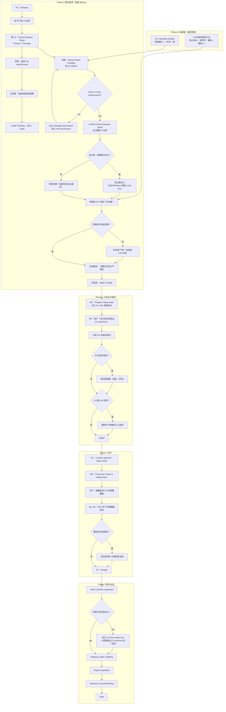

# 出口流程修订版（ByRoy 现图 + Phase I/II）

## 结论

已识读 Notion 图 `Export+Process_ByRoy.jpg`：**四阶段主干可用**。修订版补齐 S1/S2/S3、罐装 UN、年切换、相容性/精确生产日。  

**Jason 确认（2026-08-12）：** 图中「1st time export test」与纪要「首出口 Lead-time」为**同一动作**——申请/排产时只做「是否首出口」判定并预留 Milestone；**执行**仍用 Phase IV 该节点，勿拆成两套流程。Lead-time **天数**待 Jason 回填。

**Initiate 跨部门检查（v1）：** 业务提出出口后、排产前，由**出口部门**按部门勾选，见 `export-initiate-checklist.md` 与 `deliverables/出口Initiate跨部门Checklist.xlsx`。时限与首出口天数待整厂出口流程图补入。

## 责任泳道（建议）

| 泳道 | 对应 ByRoy 列 | 职责要点 |
|---|---|---|
| 业务 / PC | Project Coordinator | 查 S2、填 S1、确认 SO、接受培训 |
| 采购 | Procurement | 维 S2/S3、UN 要求、toolbox、新包装评估（默认不推荐） |
| 出口部 | （现图并入 Logistic） | 首出口判定、执行首出口检测、报关出运 |
| 计划 MP | Material Planning | 排产 / Filling Order（首出口则 Milestone 含 Lead-time） |
| 生产 & QC | Production & QC | 按罐装单 UN 罐装；生产日进 SAP |
| 仓库物流 | Logistic（仓段） | UN 包装收货、隔离/报废、出库贴标协同 |
| 实验室/第三方 | Customer Lab（建议改名） | 物性数据；按需相容性自检 |
| Order Clearing | Order Clearing | SDS / Label 资料 |

## 相对 ByRoy 现图的关键增补

1. 显式 **S1/S2/S3**（Request Sheet≈S1，toolbox≈S2，S3 新增）  
2. 首出口：**同一动作**——早判定进 Milestone + Phase IV 执行「1st time export test」  
3. 罐装单 **UN 号** 指导现场  
4. **年切换** 隔离/报废子流程  
5. 相容性/危包证 + **精确生产日**  

## 流程图

## 源文件

- 现图审计：`export-packaging-un.md`  
- 原图副本：`deliverables/source/ExportProcess_ByRoy.jpg`  
- Mermaid：`export-process-revised.mmd`  
- SVG：`deliverables/出口UN包装流程_修订版.svg`  
