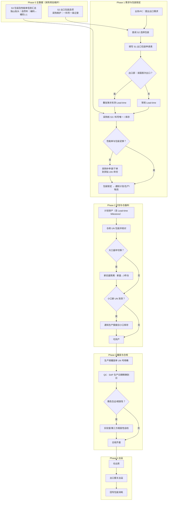

# 出口流程修订版（对齐 Phase I / II）

## 结论

Notion `Export+Process_ByRoy` **现图不可用为执行版**（几乎只有泳道表头）。下图按会议纪要重建，建议作为 **Export+Process 正式主干**；Lead-time 天数待 Jason 分析后回填。

## 责任泳道（建议替换原英文列）

| 泳道 | 职责要点 |
|---|---|
| 业务 / PC | 查 S2、填 S1、接受培训 |
| 采购 | 维 S2/S3、性能单与包装采购、UN 切换通知 |
| 出口部 | 首出口判定、海关 Lead-time、报关出运 |
| 计划 MP | 排产 Milestone（含 Lead-time） |
| 生产 & QC | 按罐装单 UN 罐装；生产日进 SAP |
| 仓库物流 | UN 包装收货、隔离/报废协同、出库 |
| 实验室/第三方 | 相容性自检（按需） |

## 流程图

## 相对 ByRoy 现图的关键增补

1. S1 门禁 + S2/S3 主数据  
2. 首出口 Lead-time 分支  
3. 罐装单 UN 指导现场  
4. 年切换隔离/报废（可画并行子流程，见 `export-process-revised.mmd`）  
5. 相容性与精确生产日  

## 源文件

- 详细问题与纪要：`export-packaging-un.md`  
- Mermaid 源：`export-process-revised.mmd`  
