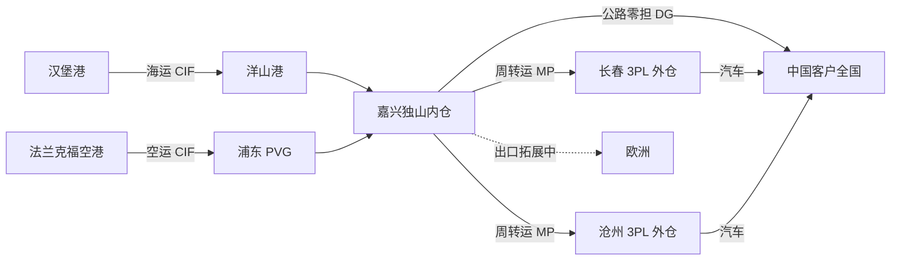

# 供应链网络总览

## 节点清单

| 节点 | 类型 | 地点 | 功能 | 自营/3PL | 库存规模（约） | 服务范围 |
|---|---|---|---|---|---|---|
| 嘉兴工厂内仓（独山） | Plant WH | 中国嘉兴·独山 | 成品 / 半成品 / 原料存储；配合生产；其他附加物流服务 | 工厂内仓（与工厂一体） | 1500–2000 吨 | **约 80% 货量**；覆盖全国；**所有 BU** |
| 长春外仓 | RDC | 中国长春 | 存储（汽车相关） | **3PL** | 30–60 吨 | **仅汽车** |
| 沧州外仓 | RDC | 中国沧州 | 存储（汽车相关） | **3PL** | 1–5 吨 | **仅汽车** |
| 德国汉堡总部 | HQ | 德国汉堡 | 集团总部；进口运输供应商指定方 | — | — | — |

## 主要货流

| 起点 | 终点 | 货类 | 主模式 | 备注 |
|---|---|---|---|---|
| 德国汉堡港 | 上海洋山港 → 嘉兴独山仓 | 进口成品/半成品（及进口货） | 海运，**CIF** | 德国指定承运商 |
| 法兰克福空港 | 上海浦东 PVG → 嘉兴独山仓 | 进口（时效更高） | 空运，**CIF** | 德国指定承运商 |
| 嘉兴独山仓 | 长春外仓 | 汽车相关 | 公路调拨 | **每周**由计划（MP）安排转运单 |
| 嘉兴独山仓 | 沧州外仓 | 汽车相关 | 公路调拨 | **每周**由计划（MP）安排转运单 |
| 嘉兴 / 外仓 | 中国客户 | 成品为主 | 公路零担，**危险品**为主 | 见国内配送 |
| 嘉兴 | 欧洲（出口） | — | — | **尚无稳定运行线路**（拓展中） |

## 港口 / 枢纽偏好

### 进口（已运行）

| 方向 | 起运 | 到港/机场 |
|---|---|---|
| 海运 | 德国汉堡港 | 上海洋山港 |
| 空运 | 法兰克福空港 | 上海浦东机场（PVG） |

### 出口欧洲（拓展中）

- 状态：无稳定运行线路
- 当前最大阻塞（物流视角）：
  1. **出口危险品**相关能力与流程
  2. **出口包装管控流程不清晰**：难以确定「什么产品用什么包装」；罐装时如何保证使用正确包装、对应正确 **UN 包装编号**

## 国内配送

- 主模式：公路零担，危险品运输为主
- 季节性：夏/冬对温度敏感产品 → 公路零担 + **危险品温控**运输

## 原材料进厂路径

- 状态：**待补充**（后续涉及该主题时再填）

## 网络结构示意

## 备注 / 对框架的启示

- 仓网呈 **中心辐射**：嘉兴独山为主仓（全 BU、全国），长春/沧州为汽车卫星仓。
- 出口欧洲的卡点不在「有没有船」，而在 **危化品出口 + UN 包装管控闭环** → 建议在 `02-products` 增补专题，或立 `projects/` 项目跟踪。
- 原材料进厂路径仍空，暂不据此做原料物流建议。
